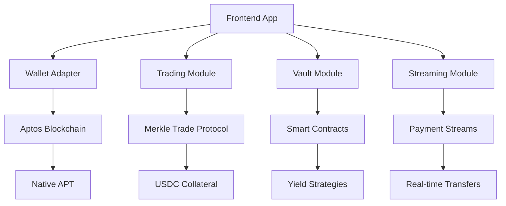

# Remora DeFi Platform

<div align="center">
  
  
  **Next-Generation DeFi Platform on Aptos Blockchain**
  
  [](https://github.com/remora-ctrl-move-hackathon/remora-main)
  [](LICENSE)
  [](https://github.com/remora-ctrl-move-hackathon/remora-main/actions)
</div>

---

## 🌟 Overview

Remora is a comprehensive DeFi platform built on the Aptos blockchain that provides users with advanced financial tools including **Perpetual Trading**, **Streaming Payments**, **Vault Management**, **Off-ramp Services**, and **Remittance Solutions**.

### Key Features

- 🚀 **Perpetual Trading** - Advanced derivatives trading with up to 150x leverage
- 💰 **Smart Vaults** - Automated DeFi yield strategies
- 🔄 **Streaming Payments** - Real-time money streams
- 🌍 **Global Remittance** - Cross-border payments
- 📊 **Analytics Dashboard** - Portfolio insights and analytics
- 🏦 **Off-ramp Services** - Convert crypto to fiat seamlessly

---

## 🏗️ Architecture

### Technology Stack

| Component | Technology | Purpose |
|-----------|------------|---------|
| Frontend | Next.js 15.5.4 | React-based web application |
| Blockchain | Aptos | Layer 1 blockchain for smart contracts |
| Trading Engine | Merkle Trade SDK | Perpetual derivatives trading |
| Wallet Integration | Aptos Wallet Adapter | Multi-wallet support |
| Styling | Tailwind CSS | Utility-first CSS framework |
| State Management | React Hooks | Component state management |
| Type Safety | TypeScript | Static type checking |

### System Architecture



---

## 🚀 Quick Start

### Prerequisites

- Node.js 18+ 
- npm or yarn
- Aptos wallet (Petra, Martian, etc.)

### Installation

```bash
# Clone the repository
git clone https://github.com/remora-ctrl-move-hackathon/remora-main.git

# Navigate to frontend
cd remora-main/frontend

# Install dependencies
npm install

# Start development server
npm run dev
```

### Environment Setup

Create a `.env.local` file:

```env
NEXT_PUBLIC_APTOS_NETWORK=testnet
NEXT_PUBLIC_MODULE_ADDRESS=0x...
```

---

## 📖 Table of Contents

### Getting Started
- [Installation Guide](./installation.md)
- [Configuration](./configuration.md)
- [First Steps](./getting-started.md)

### Core Modules
- [Perpetual Trading](./modules/trading.md)
- [Vault Management](./modules/vaults.md)
- [Streaming Payments](./modules/streaming.md)
- [Remittance Services](./modules/remittance.md)
- [Off-ramp Integration](./modules/offramp.md)

### Development
- [API Reference](./api/README.md)
- [Smart Contracts](./contracts/README.md)
- [Frontend Components](./frontend/README.md)
- [Testing Guide](./testing.md)

### Deployment
- [Production Deployment](./deployment/production.md)
- [Testnet Deployment](./deployment/testnet.md)
- [Environment Variables](./deployment/environment.md)

---

## 🔧 Development

### Project Structure

```
remora-main/
├── frontend/                  # Next.js frontend application
│   ├── src/
│   │   ├── app/              # App router pages
│   │   ├── components/       # Reusable UI components
│   │   ├── config/           # Configuration files
│   │   ├── hooks/            # Custom React hooks
│   │   └── services/         # API and blockchain services
│   ├── public/               # Static assets
│   └── docs/                 # Documentation
└── contracts/                # Smart contracts (if applicable)
```

### Contributing

We welcome contributions! Please see our [Contributing Guide](./CONTRIBUTING.md) for details.

---

## 📞 Support & Community

- **Documentation**: [docs.remora.finance](https://docs.remora.finance)
- **Discord**: [Join our community](https://discord.gg/remora)
- **Twitter**: [@RemoraFinance](https://twitter.com/RemoraFinance)
- **GitHub Issues**: [Report bugs & feature requests](https://github.com/remora-ctrl-move-hackathon/remora-main/issues)

---

## 📄 License

This project is licensed under the MIT License - see the [LICENSE](LICENSE) file for details.

---

## 🙏 Acknowledgments

- **Aptos Foundation** - For the robust blockchain infrastructure
- **Merkle Trade** - For the perpetual trading protocol
- **Next.js Team** - For the excellent React framework
- **Tailwind CSS** - For the utility-first CSS framework

---

<div align="center">
  <p><strong>Built with ❤️ for the DeFi community</strong></p>
  <p>© 2024 Remora Finance. All rights reserved.</p>
</div>